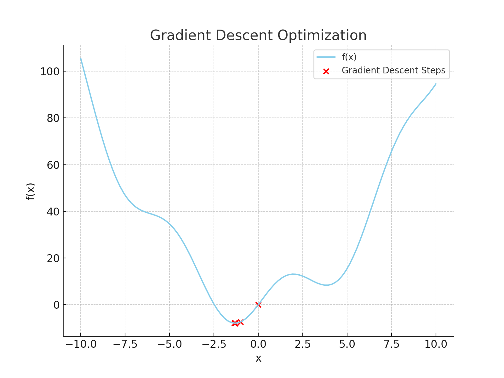

# Gradient Descent Visualization

##  Overview
This project demonstrates **Gradient Descent Optimization** using Python and NumPy. The function to be minimized is:

\
f(x)=x^2 +10sin(x)


A **gradient descent algorithm** iteratively updates \( x \) based on the gradient of \( f(x) \) to find the minimum. The process is visualized using Matplotlib.

---

##  How Gradient Descent Works
Gradient Descent is an optimization algorithm used to minimize a function by iteratively moving in the direction of the **negative gradient**.

### **Gradient Descent Formula**
\
x_new = x_old - η⋅∇f(x)

Where:
- η (**learning rate**) controls step size.
- \( 
∇f(x) \) is the gradient (derivative) of \( f(x) \).
- The process repeats for a set number of iterations or until convergence.

### **Gradient of the Function**
\[
 f(x) = 2x + 10 \cos(x)
\]
This derivative is used in the update step of gradient descent.

---

##  Code Explanation

### **1️⃣ Function Definition**
```python
def f(x):
    return x**2 + 10 * np.sin(x)
```
This function \( f(x) \) is the objective function to be **minimized**.

### **2️⃣ Gradient (Derivative) of f(x)**
```python
def grad_f(x):
    return 2 * x + 10 * np.cos(x)
```
This computes the gradient (slope) of \( f(x) \), which helps in updating \( x \).

### **3️⃣ Gradient Descent Algorithm**
```python
def gradient_descent(starting_point, learning_rate, num_iterations):
    x = starting_point
    history = [x]  # Store history of x values
    for _ in range(num_iterations):
        gradient = grad_f(x)
        x = x - learning_rate * gradient
        history.append(x)
    return x, history
```
- Starts at `starting_point`.
- Iteratively updates `x` using the **gradient descent formula**.
- Stores all values of `x` for visualization.

### **4️⃣ Running Gradient Descent**
```python
starting_point = 0.0
learning_rate = 0.1
num_iterations = 50
x_opt, history = gradient_descent(starting_point, learning_rate, num_iterations)
```
- Starts at \( x = 0.0 \).
- Uses a **learning rate of 0.1**.
- Runs for **50 iterations**.

### **5️⃣ Visualization**
```python
x_vals = np.linspace(-10, 10, 100)
plt.plot(x_vals, f(x_vals), label="f(x)")
plt.scatter(history, [f(x) for x in history], c="red", label="Gradient Descent Steps")
plt.legend()
plt.title("Gradient Descent Optimization")
plt.xlabel("x")
plt.ylabel("f(x)")
plt.show()
```
- Plots \( f(x) \) as a curve.
- **Marks gradient descent steps in red**, showing how \( x \) moves toward the minimum.

---

##  Visualization Example


The output plot shows:
- The **blue curve** as \( f(x) \).
- **Red dots** marking each step of gradient descent, moving toward the minimum.

---


#### **🔹 Adjust Learning Rate**
- **Too small** → Slow convergence.
- **Too large** → Might overshoot and never converge.

